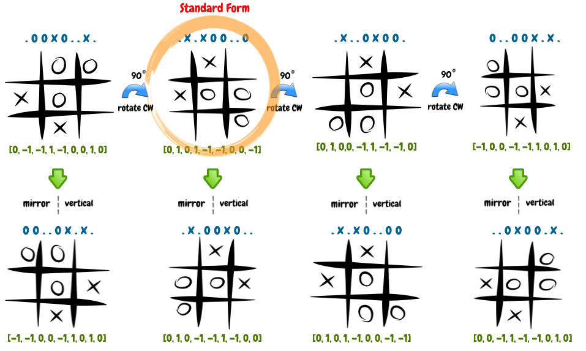

==============================================================
MENACER: Machine Educable Noughts and Crosses Engine - Revived
==============================================================

.. From Layman's Perspective

**MENACER** (``Machine Educable Noughts and Crosses Engine - Revived``) is a computer program that plays the game of Noughts and Crosses (aka. Tic-Tac-Toe). It learns, evolves and gets better at the game with every game it plays.

API Examples
============

----------------
MENACER vs Human
----------------

..	code:: python
	
	from menacer import AgentX, AgentO, playNoughtsCrosses

	# Initialize MDP Agent that plays 'X' with random policy
	agentx = AgentX()
	agento = 'human'

	while True:
		# Simulate a game between agentx and agento
		game = playNoughtsCrosses(agentx, agento)

		# Update the MDP and policy of agentx to learn from game
		agentx.learnGameplay([game])

------------------
MENACER vs MENACER
------------------

..	code:: python

	from menacer import AgentX, AgentO, playNoughtsCrosses

	# Initialize MDP Agents that plays 'X' and 'O' with random policies
	agentx = AgentX()
	agento = AgentO()

	# Define the number games to be simulated
	n_games = 1000

	for i_game in range(n_games):

		# Simulate a game between agentx and agento
		game = playNoughtsCrosses(agentx, agento)

		# Update the MDP and policy of agents to learn from game
		agentx.learnGameplay([game])
		agento.learnGameplay([game])

--------------------------------------
Dumping and Loading Pre-Trained Agents
--------------------------------------

Pre-trained agents can be *serialized*, and dumped or loaded from binary files using the `pickle <https://docs.python.org/3/library/pickle.html>`_ library.

How it Works
============

.. From Reinforcement Learning Perspective

MENACER is a simple **reinforcement learning** (RL) agent that uses **Markov Decision Process (MDP)** model to capture the dynamics of the game, and **value iteration** algorithm to determine the probabilistically optimum move to play for every possible configuration of the board.

MENACER employs two seperate **Markov Decision Process (MDP)** models to learn the dynamics of gameplay for agents that play the Noughts ('X') and the Crosses ('O') respectively.

..	contents:: Markov Decision Process (MDP) model
	:local:

-------------------
Representing States
-------------------

The various possible configurations of the *Noughts and Crosses* board correspond to the states in the MDP models. 

The MDP model of an agent (either the agent that plays *Noughts* or the agent that plays *Crosses*) only involves states where **the agent plays the next move**, along with states that correspond to the **won, lost and drawn** configurations of the board.

The board configurations can be represented in two forms:

+ 	**String Representation:** a 9-character string composed of '**x**' (noughts), '**o**' (crosses) and '**.**' (empty space).
	**Example:** '.ooxo..x.'

.. _`array representation`:

+ 	**Array Representation:** a 9-element array composed of '1' (noughts), '0' (empty space) and '-1' (crosses).
	**Example:** [0, -1, -1, 1, -1, 0, 0, 1, 0]

The string notation can be conveniently used as keys in the hashing data structures used to store the policy, transition probabilities and rewards for the states in the MDP model.

Standard Form of a State
------------------------

The next move to play for a given board configuration is symmetric (or identical) for *rotated and/or mirrored* configurations of the board. The board configurations can be represented in a rotation and mirror-invariant form called the **standard form**.

	The **standard form** of a board configuration is the board configuration which has the lexicographically largest `array representation`_ among the eight possible rotated and/or mirrored configurations of the given board.

..

The use of the standard form of the board configurations to represent the states in the MDP models drastically reduce the number of possible states and improve the learning capability of the agent.

--------------------
Representing Actions
--------------------

.. End of image directive

The various *next moves* (or positions) that an agent can play for a given board configuration correspond to **actions** that can be performed at the corresponding state in the MDP model.

The possible actions that can be performed at a given state in the MDP models are encoded as a *subset of numbers enumerated from 0 to 8*, each corresponding to one of the nine possible positions in the board.

Contributor's Section
=====================

The MENACER community encouages all its members to contribute to the project in however small ways possible.

Some of the important milestones in the future roadmap of MENACER include:

+ **Creation of Website:** Since, large hours of training are necessary for the agents to capture the complete dynamics of the game and evolve to become expert players in the game of Noughts and Crosses, creation of a website where the users can play against MENACER is of primal focus.
  
Please refer to `issues <https://github.com/elixir-code/MENACER/issues>`_ section for related discussion and more information on possible directions of future work.